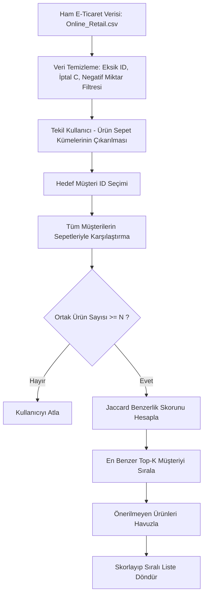

# 🛒 Personalized E-Commerce Product Recommendation System
> **User-Based Collaborative Filtering Engine using Jaccard Similarity**

Bu proje, gerçek e-ticaret işlem verilerini (**UCI Online Retail**) kullanarak kullanıcıların satın alma davranışlarını analiz eden ve **Kullanıcı Tabanlı İşbirlikçi Filtreleme (User-Based Collaborative Filtering)** yaklaşımıyla kişiselleştirilmiş ürün önerileri sunan bir makine öğrenmesi / veri madenciliği motorudur.

---

### Proje Akış Şeması (Flowchart)



###  Proje Dizin Yapısı

```text
personalized-recommendation-engine/
├── data/
│   └── Online_Retail.csv
├── src/
│   ├── __init__.py
│   ├── data_loader.py
│   ├── preprocessing.py
│   ├── similarity.py
│   └── recommender.py
├── app.py
├── main.py
├── exploration.ipynb
├── requirements.txt
├── .gitignore
└── README.md
```
